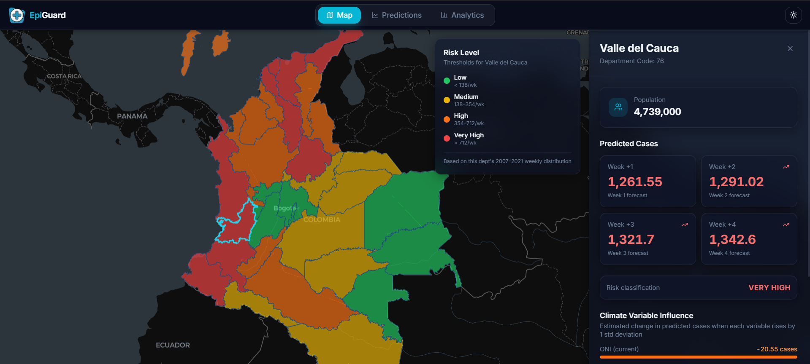
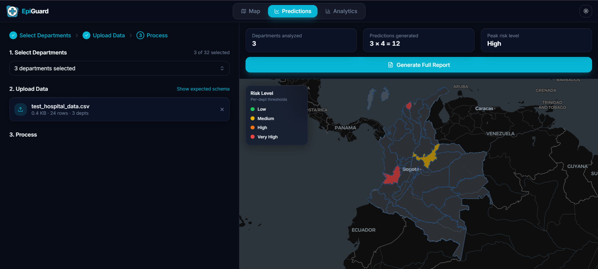
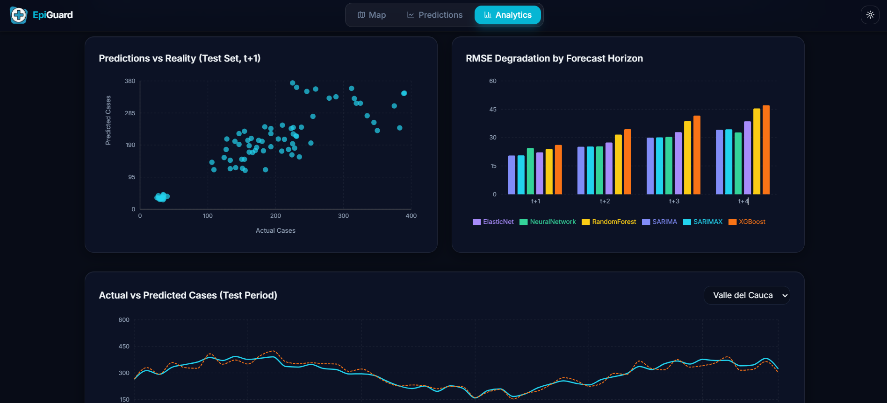
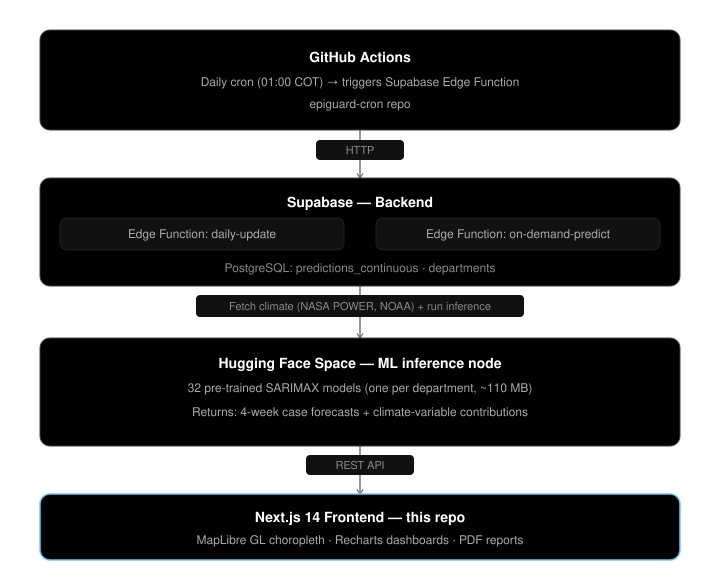

# EpiGuard

**Epidemiological early-warning platform for dengue fever in Colombia.**

EpiGuard predicts dengue risk at the departmental level up to 4 weeks ahead, translating SARIMAX model output into categorical alerts and actionable recommendations for public-health decision-makers. It integrates historical surveillance data (SIVIGILA 2007–2023), meteorological data (NASA POWER), and the Oceanic Niño Index (NOAA) across all 32 Colombian departments.

[](https://epiguardapp.vercel.app)
[](https://nextjs.org)
[](https://www.typescriptlang.org)
[](https://tailwindcss.com)
[](https://supabase.com)
[](https://huggingface.co)

---

## Table of Contents

- [Live Demo](#live-demo)
- [Features](#features)
- [Screenshots](#screenshots)
- [System Architecture](#system-architecture)
- [Model Results](#model-results)
- [Risk Classification](#risk-classification)
- [Tech Stack](#tech-stack)
- [Getting Started](#getting-started)
  - [Prerequisites](#prerequisites)
  - [Installation](#installation)
- [File Upload Schema](#file-upload-schema)
- [Repository Structure](#repository-structure)
- [Known Limitations](#known-limitations)

---

## Live Demo

Platform deployed on Vercel: **[epiguardapp.vercel.app](https://epiguardapp.vercel.app)**

---

## Features

| View | Description |
|---|---|
| **Risk Map** | Interactive choropleth of Colombia colored by current risk level (Low / Medium / High / Very High). Click any department to see its 4-week forecast and the signed contribution of each climate variable to the prediction. |
| **On-demand Predictions** | Upload a CSV / JSON / XLSX file with historical weekly case counts, select departments, and invoke the SARIMAX inference pipeline. Results are shown on a map with PDF export. |
| **Analytics** | Static evaluation dashboard comparing six model families — SARIMA, SARIMAX, Neural Network (MLP), ElasticNet, Random Forest, and XGBoost — on the 2022–2023 held-out test set. |

---

## Screenshots

### Risk Map — national choropleth with department sidebar


### On-demand Predictions — file upload and results


### Analytics — model comparison dashboard


---

## System Architecture



---

## Model Results

Six model families were trained and evaluated on the same chronological splits (train 2007–2018, validation 2019–2021, test 2022–2023). The table below shows the final ranking by weighted RMSE across the four prediction horizons (weights 4:3:2:1, emphasizing near-term accuracy):

| Rank | Model | Weighted RMSE | Week 1 MAE | Week 4 MAE |
|:---:|---|:---:|:---:|:---:|
| 1 | SARIMA | 25.17 | 10.57 | 16.58 |
| **2** | **SARIMAX** *(deployed)* | **25.28** | **10.66** | **16.65** |
| 3 | Neural Network (MLP) | 26.76 | 10.31 | 15.16 |
| 4 | ElasticNet | 27.54 | 11.46 | 18.38 |
| 5 | Random Forest | 31.37 | 11.13 | 18.14 |
| 6 | XGBoost | 33.83 | 11.33 | 18.16 |

> SARIMAX is deployed over SARIMA despite a 0.46% RMSE gap because it attributes each forecast to specific climate variables (temperature, precipitation, humidity, ONI, ONI lagged 4 months) — a requirement for the interpretability panel in the UI.

---

## Risk Classification

Predictions are mapped to four ordinal levels using **department-specific historical percentiles** (not national fixed thresholds), so a small department like Chocó gets the same alert sensitivity as Valle del Cauca:

| Level | Threshold | Recommended Action |
|---|:---:|---|
| Low | < p50 | Routine SIVIGILA surveillance |
| Medium | p50 – p80 | Increased vector monitoring; notify municipal heads |
| High | p80 – p95 | Deploy vector-control brigades; pre-position medical supplies |
| Very High | > p95 | Institutional escalation; activate response protocols with INS and Ministry of Health |

---

## Tech Stack

| Layer | Technology |
|---|---|
| Framework | Next.js 15 (App Router), React 18, TypeScript |
| Styling | Tailwind CSS, shadcn/ui |
| Map | MapLibre GL, react-map-gl, TopoJSON |
| Charts | Recharts |
| Backend | Supabase (PostgreSQL + Edge Functions) |
| ML inference | statsmodels SARIMAX on Hugging Face Spaces |
| Automation | GitHub Actions (`.github/workflows/daily-update.yml`) |
| File parsing | PapaParse (CSV), @e965/xlsx (XLSX) |
| PDF export | pdfmake |

---

## Getting Started

### Prerequisites

- Node.js 18+
- A Supabase project with the `predictions_continuous` and `departments` tables and the `on-demand-predict` Edge Function deployed.

### Installation

1. Clone the repository and install dependencies:

```bash
git clone https://github.com/LucasRomero26/epiguard.git
cd epiguard
npm install
```

2. Create `.env.local` at the project root:

```env
NEXT_PUBLIC_SUPABASE_URL=https://<your-project>.supabase.co
NEXT_PUBLIC_SUPABASE_ANON_KEY=<your-anon-key>
```

3. Start the development server:

```bash
npm run dev      # http://localhost:3000
npm run build    # production build
npm start        # start production server
```

---

## File Upload Schema

The Predictions view accepts CSV, JSON, or XLSX files:

| Column | Type | Example |
|---|---|---|
| `dept_code` | integer | `76` |
| `week_iso` | string (`YYYY-WNN`) | `2024-W40` |
| `cases` | number ≥ 0 | `142` |

Column aliases (`COD_DPTO`, `SEMANA_ISO`, `casos`) are recognized automatically. Minimum 4 rows per department; maximum 1 000 rows per upload.

---

## Repository Structure

```
epiguard/
├── app/                   # Next.js App Router pages
│   ├── page.tsx           # Root — switches between the three views
│   ├── layout.tsx
│   └── globals.css
├── components/
│   ├── map/               # ColombiaMap, DepartmentSidebar, RiskLegend
│   ├── views/             # MapView, PredictionsView, AnalyticsView
│   └── ui/                # shadcn/ui primitives
├── lib/
│   ├── api.ts             # Supabase data-fetching layer
│   ├── types.ts           # Shared TypeScript interfaces
│   ├── pdfReport.ts       # Multi-page PDF generation (pdfmake)
│   ├── parseFile.ts       # CSV/JSON/XLSX ingestion and validation
│   ├── supabase.ts        # Supabase client (lazy singleton)
│   └── data/
│       └── departments.ts # Static department metadata (DANE codes, population)
├── .github/workflows/     # daily-update.yml (cron predictions) + lint-typecheck.yml (CI)
├── types/                 # Ambient TS declarations (image modules)
└── public/
    └── colombia_departamentos.json  # TopoJSON boundary file
```

---

## Known Limitations

- **Climate persistence assumption:** the 4-week climate inputs for production forecasts are extrapolated from the most recent observed NASA POWER data, not numerical weather forecasts. This introduces error during seasonal transitions.
- **HF Space cold start:** the first on-demand inference request after 48 h of inactivity can take 30–60 seconds while the Space wakes up.
- **Bogotá D.C.** (DANE code 11) is excluded from per-department modeling and merged visually with Cundinamarca (25) on the map.
- This is a research prototype and should not be the sole basis for public-health decisions.

---